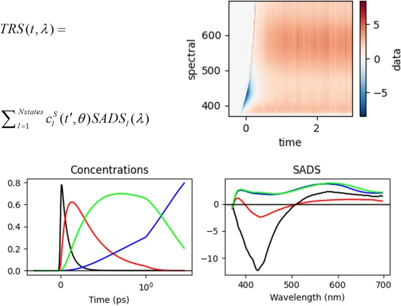

# pyglotaran-publications

This repository collects references to (scientific) publications, tutorials or projects that make used of the pyglotaran software in some way, in the hope that these examples are useful to the community.

- References are organized [by year](#by-year).
- Every now and then, a new publication will be placed in the [spotlight](#spotlight).

## Spotlight

✨ **Pyglotaran: a lego-like Python framework for global and target analysis of time-resolved spectra**

<!-- prettier-ignore-start -->
|  | 📈 Fitting time-resolved spectroscopy (TRS) data in Python.    🔬 Variable Projection   🤸‍♂️ Flexible model specification   📓 Jupyter Notebook Support|
| - | - |
<!-- prettier-ignore-end -->

## Publications by year

### [2024](2024/README.md)

- **[Target Analysis Resolves the Ground and Excited State Properties from Femtosecond Stimulated Raman Spectra](2024/README.md)**
   📅 2024-09-06
   🔗 DOI: [10.1021/acs.jpclett.4c01555](https://doi.org/10.1021/acs.jpclett.4c01555)

### [2023](2023/README.md)

- **[Energy transfer and trapping in photosystem I with and without chlorophyll-f](<https://www.cell.com/iscience/fulltext/S2589-0042(23)01727-3>)**
   📅 2023-08-14
   🔗 DOI: [10.1016/j.isci.2023.107650](https://doi.org/10.1016/j.isci.2023.107650)

- **[pyglotaran: a lego-like Python framework for global and target analysis of time resolved spectra](2023/README.md#📚-pyglotaran-a-lego-like-python-framework-for-global-and-target-analysis-of-time-resolved-spectra)**
   📅 2023-07-31
   🔗 DOI: [10.1007/s43630-023-00460-y](https://doi.org/10.1007/s43630-023-00460-y)

## Contributing

See the [contributing guide](CONTRIBUTING.md) if you wish to add you own reference.

## License

Except where otherwise noted, the work in this repository is dual-licensed under `GNU Lesser General Public License v3.0 or later` ([LGPL-3.0-or-later](https://spdx.org/licenses/LGPL-3.0-or-later.html)) or `Creative Commons Attribution 4.0 International` [(CC-BY-4.0)](https://spdx.org/licenses/CC-BY-4.0.html).

These licenses are provided in plain text as a convenience to the user as [LICENSE](LICENSE) and [LICENSE-CC-BY](LICENSE-CC-BY) respectively.

`SPDX-License-Identifier: LGPL-3.0-or-later OR CC-BY-4.0`

