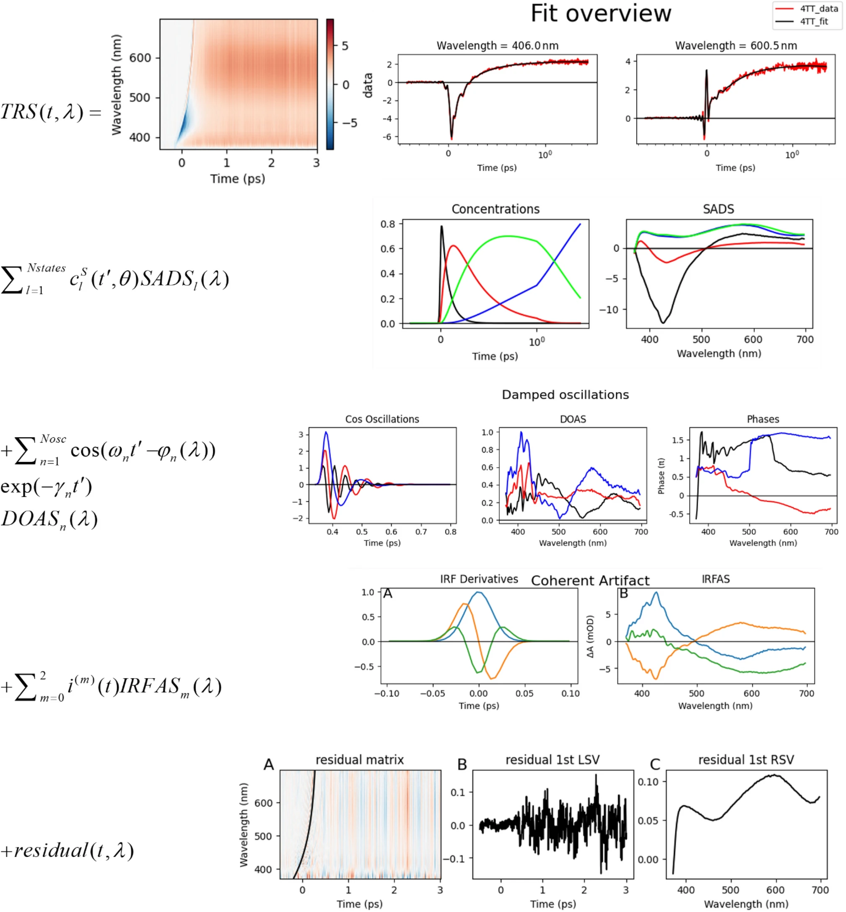

# SPOTLIGHT

---

This is an experimental layout, suggestions for better layouts welcome

---

### [pyglotaran: a lego-like Python framework for global and target analysis of time resolved spectra](https://doi.org/10.1007/s43630-023-00460-y)

This paper introduces [pyglotaran](https://github.com/glotaran/pyglotaran), a new Python framework for global and target analysis of time-resolved spectra, and the spiritual successor to ([legacy](https://github.com/glotaran/glotaran-legacy)) [Glotaran](https://doi.org/10.18637/jss.v049.i03).

The novel features are showcased through three case studies, for which Jupyter notebooks are available:

1. The first study uses guidance spectra and a parametric description to detail "coherent artifact" (CA) in transient absorption, revealing the framework's capability to resolve vibrational wavepackets via damped oscillations.
   1. [4TT/sequential_doas_4TT.ipynb](https://github.com/glotaran/pyglotaran-release-paper-supplementary-information/releases/download/accepted-for-publication/sequential_doas_4TT.ipynb)
2. The second focuses on the light-absorbing efficiency of multichromophoric systems, especially when comprised of two chromophores.
   1. [rc/target_rc_part1.ipynb](https://github.com/glotaran/pyglotaran-release-paper-supplementary-information/releases/download/accepted-for-publication/target_rc_part1.ipynb)
   2. [rc/target_rcg_compare_part2.ipynb](https://github.com/glotaran/pyglotaran-release-paper-supplementary-information/releases/download/accepted-for-publication/target_rcg_compare_part2.ipynb)
   3. [rc/target_rcg_gcrcg_rcgcr_refine_part3.ipynb](https://github.com/glotaran/pyglotaran-release-paper-supplementary-information/releases/download/accepted-for-publication/target_rcg_gcrcg_rcgcr_refine_part3.ipynb)
3. The final case study elucidates the energy transfer pathways in the time-resolved emission of whole photosynthetic cells, characterizing the contributions of numerous megacomplexes. These studies span systems ranging from singular chromophores to a megacomplex of approximately 500, with temporal resolutions between ≈10 fs to ≈10 ps.
   1. [dPSI/ex_four_datasets_two_guidance_with_area_irf-with_sum_plot_minimal.ipynb
](https://github.com/glotaran/pyglotaran-release-paper-supplementary-information/releases/download/accepted-for-publication/ex_four_datasets_two_guidance_with_area_irf-with_sum_plot_minimal.ipynb)

The figure below visually summarizes the results from the first case-study. All plots are generate using [pyglotaran](https://github.com/glotaran/pyglotaran) and the plotting package [pyglotaran-extras](https://github.com/glotaran/pyglotaran-extras).

[Figure 1](https://link.springer.com/article/10.1007/s43630-023-00460-y/figures/1) of [10.1007_s43630-023-00460-y](https://doi.org/10.1007/s43630-023-00460-y) (reproduced as is) showing axample of a
- time-resolved difference absorption Spectrum and fit thereof (row 1),
- with the help of a compartmental model (row 2),
- the damped oscillations (row 3),
- a “coherent artifact” (CA) (row 4)
- and the residual (row 5).

DOI: [10.1007/s43630-023-00460-y](https://doi.org/10.1007/s43630-023-00460-y)

---
